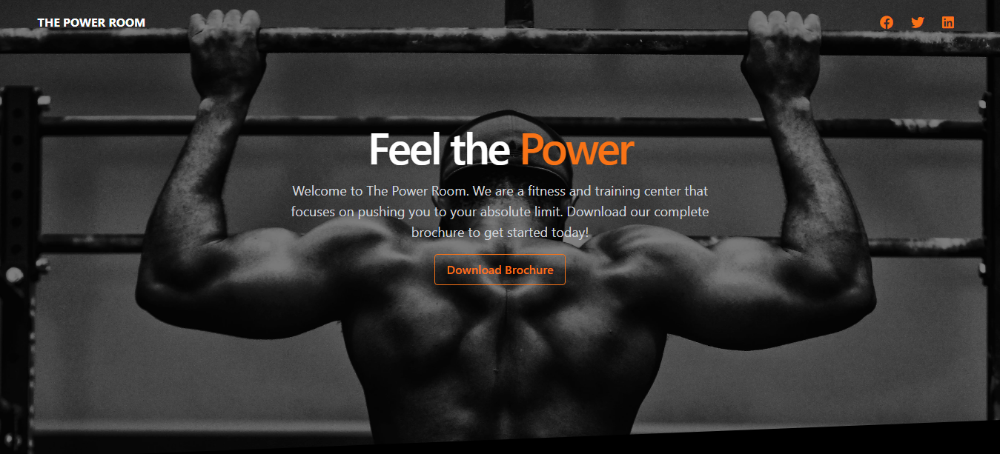

 



## Table of Contents

- [Description](#description)
- [Documentation](#documentation)

# Description

This is a study project where I create a landing page for a gym company

# Documentation

To run the website simple put the main.html in a browser or see the [live demo](https://gym-landing-page123.netlify.app/) here

## Build Process

To install the dependencies run:

    npm install

To build the distribution bundles run:

```
    npx tailwindcss -i ./src/input.css -o ./dist/main.css --minify
&&
    npx webpack --mode=production
```
